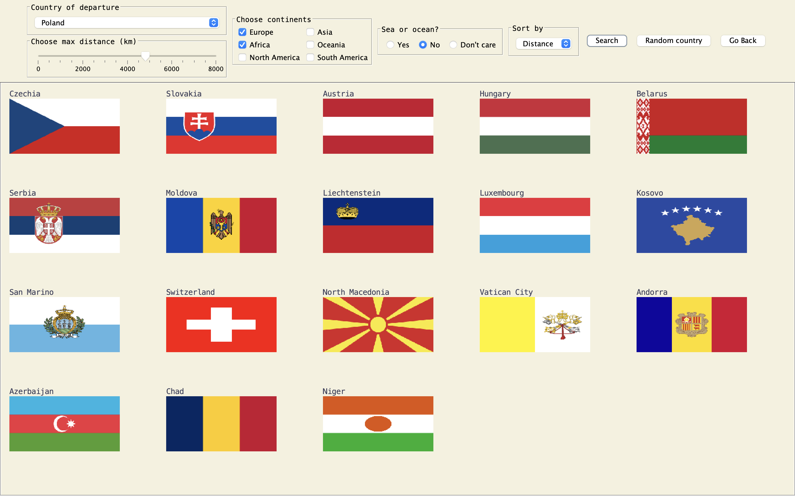
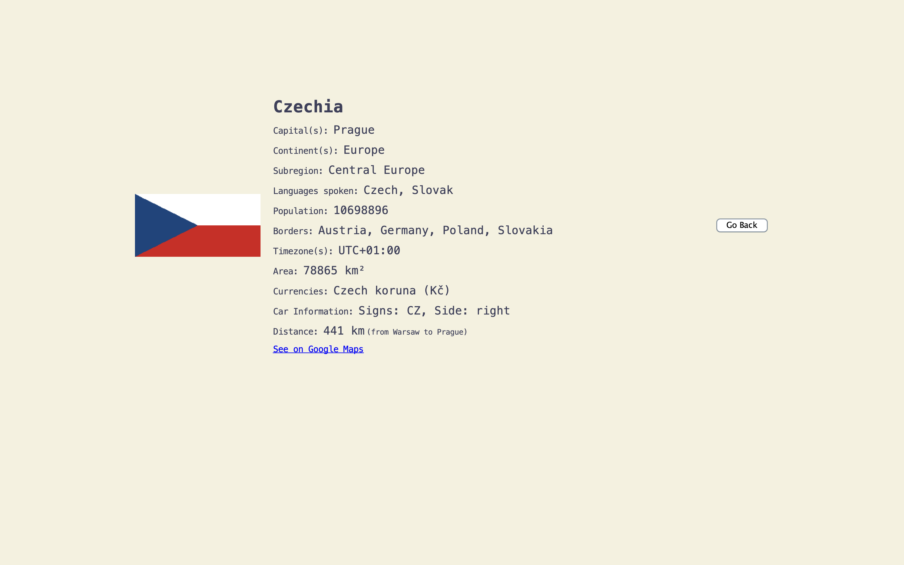

# Country Search App
*Authors: [Julia Kruk](https://github.com/krukj) & [Nadia Serafin](https://github.com/nadias03)*
## About the project
This app assists users in choosing their future travel destination. After selecting their country of origin, continents they are interested in traveling to, and other optional filters (maximum distance, access to the sea), the user will see a list of countries (flags) that match their choices. Users can also click on a specific flag to access more information about the country.
## Used technologies 
- programming language: **Java**
- used technologies and libraries:
  - URL (for REST API queries)
  - Java Swing
  - Java AWT

## App 

*The project was made for the Advanced Object - oriented Programming course during the 3rd semester of the Data Science program at the Faculty of Mathematics and Information Systems, Warsaw University of Technology.*
